# TIARCA 0.9.2 – täydellinen käyttöopas

[← Kielet](../README.md)

TIARCA on moderni Androidin IRC-asiakas, joka pohjautuu Revolution IRC:hen ja jota kehitetään itsenäisenä projektina.

## Asennus ja palvelimet
Asenna allekirjoitettu APK GitHub Releases -sivulta. Voit määrittää useita verkkoja: osoitteen, portin, nimimerkin, TLS/SSL:n, SASL:n ja automaattisesti liityttävät kanavat. Palvelinten järjestystä voi muuttaa. Älä koskaan julkaise salasanoja tai SASL-tunnuksia.

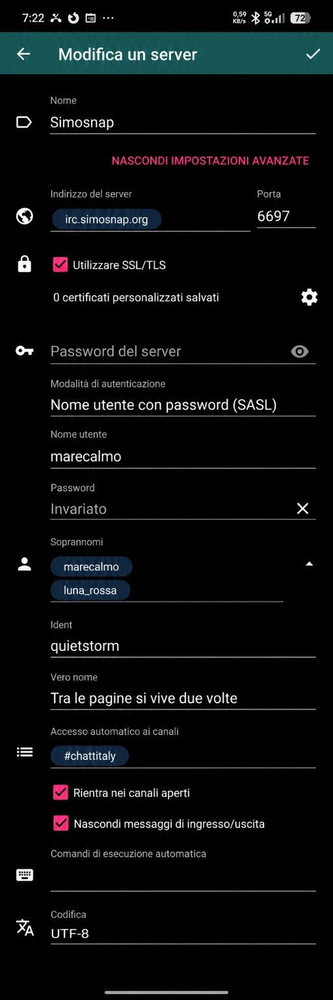

## Käyttöliittymä, kanavat ja yksityisviestit
Sivupaneeli sisältää palvelimet, kanavat ja yksityiskeskustelut. Maininnat lasketaan erillään tavallisista lukemattomista viesteistä. **Seuratut käyttäjät** on helposti saatavilla ylhäällä ja **Asetukset** pysyy `…`-valikon alimpana. Kanavat tukevat historiaa, automaattista täydennystä ja mIRC-muotoilua. Yksityiskeskusteluissa on suorat **Lähetä**- ja **Ohita**-toiminnot.

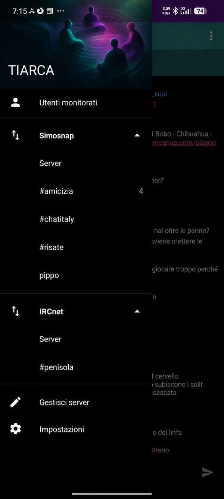

## WHOIS ja WHOWAS
WHOIS näyttää palvelimen palauttamat käyttäjätiedot ja niihin liittyvät toiminnot. WHOWAS esitetään rakenteisena tietona. Kentät riippuvat IRC-verkosta.

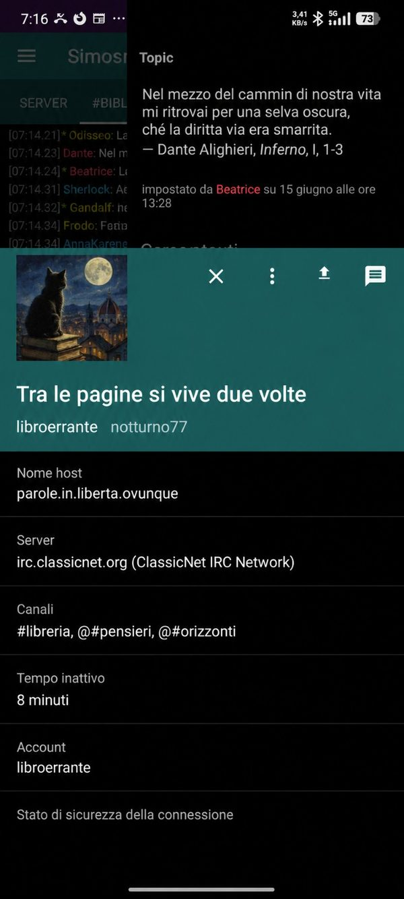

## Käyttäjä- ja kanavatilat
Tilaeditorit näyttävät aktiivisuuden ja kuvaukset sekä huomioivat IRC-palvelinperheiden erot. Palvelimen/services-palvelujen hallitsemat tilat suojataan; kanavatilojen muuttaminen riippuu oikeuksistasi.

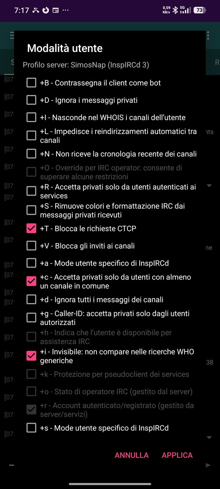
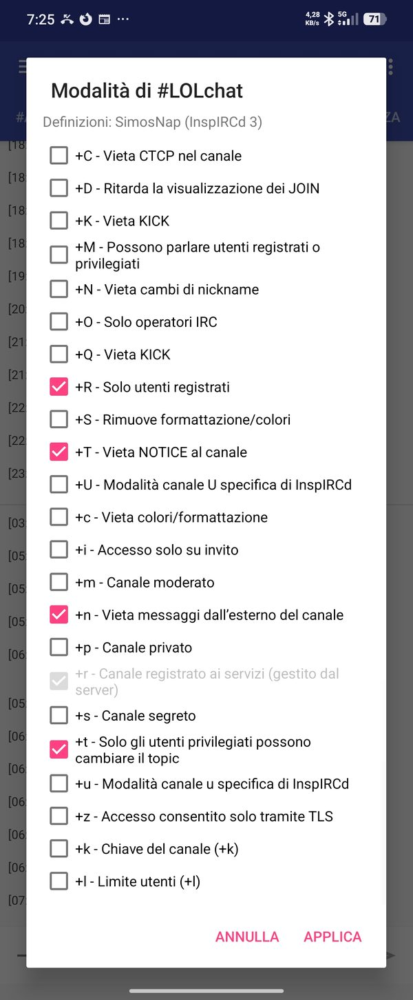

## Bannit ja poikkeukset
Kanavan banni- ja poikkeuslistat ovat yhteisessä käyttöliittymässä ja niitä voidaan hallita riittävillä oikeuksilla.

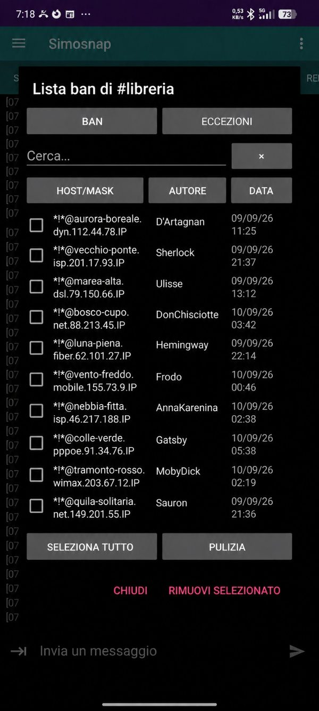

## MONITOR
Yhteensopivissa verkoissa TIARCA tukee IRC `MONITOR` -toimintoa. Seurattujen käyttäjien näkymä hallitsee listaa ja näyttää tunnetun online/offline-tilan.

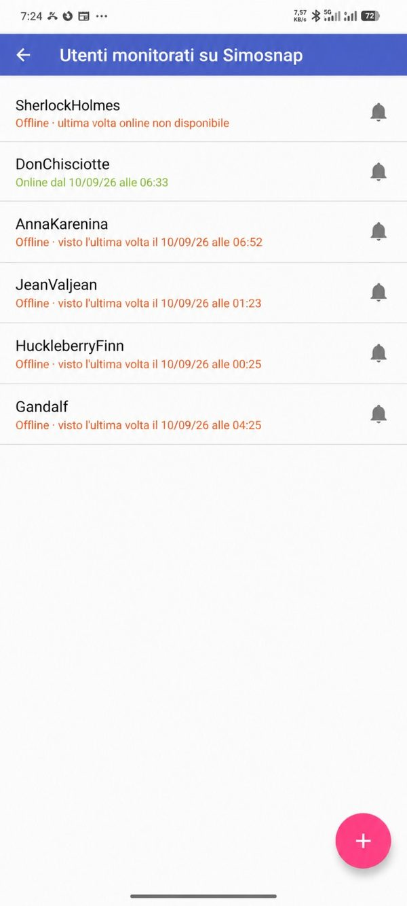

## Caller-ID +g ja ACCEPT
`+g` voi rajoittaa yksityisviestien lähettäjiä. TIARCA käsittelee numeric 718:n ja ACCEPTin. Versiosta 0.9.2 alkaen itse aloitetussa yksityiskeskustelussa `ACCEPT +nick` lähetetään automaattisesti vain, jos `+g` on oikeasti aktiivinen.

## Haku, historia, maininnat ja Ignore
Haku löytää viestejä ja siirtyy niiden ajalliseen kontekstiin. Maininnoilla on oma laskuri. Ignore suodattaa ei-toivotut käyttäjät ja toiminto löytyy suoraan yksityiskeskustelun työkalupalkista.

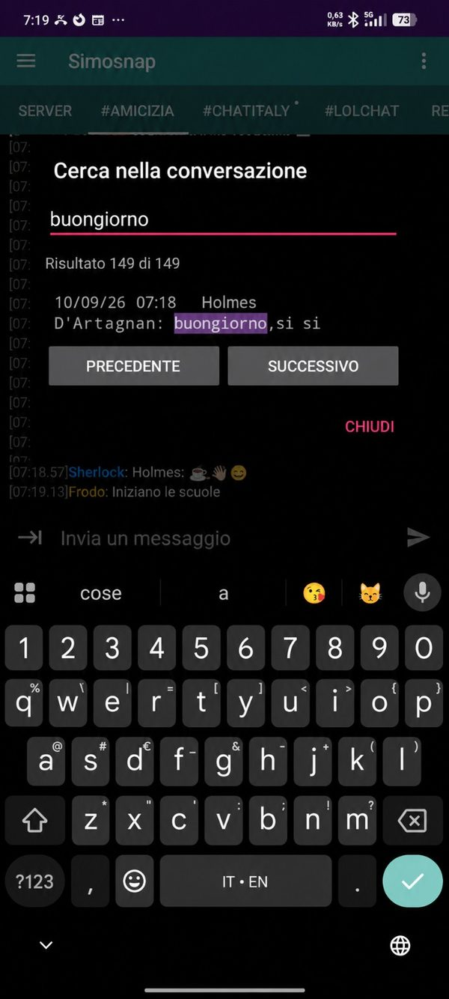

## Tiedostot ja media
Kuvia, tiedostoja, ääntä ja videota voidaan jakaa väliaikaisten linkkien kautta; linkki lähetetään vastaanottajille IRC:n kautta.

## IRC-komennot ja pikakomennot
TIARCA tukee suoraan mm. `/whowas`, `/accept`, `/invite`, `/ison`, `/userhost`, `/motd`, `/version`, `/time`, `/admin`, `/info`, `/lusers`, `/links`, `/stats`, `/knock`, `/list`, `/names` ja `/who`. Muokattavia pikakomentoja ovat esimerkiksi `!yt`, `!wiki`, `!calc`, `!movie`, `!ora` ja `!dizionario`.

## Ulkoasu
Vaalea/tumma teema, sovelluksen värit, chat-fontti ja viestimuoto ovat muokattavissa; myös valinnainen oikean reunan kellonaika on tuettu.

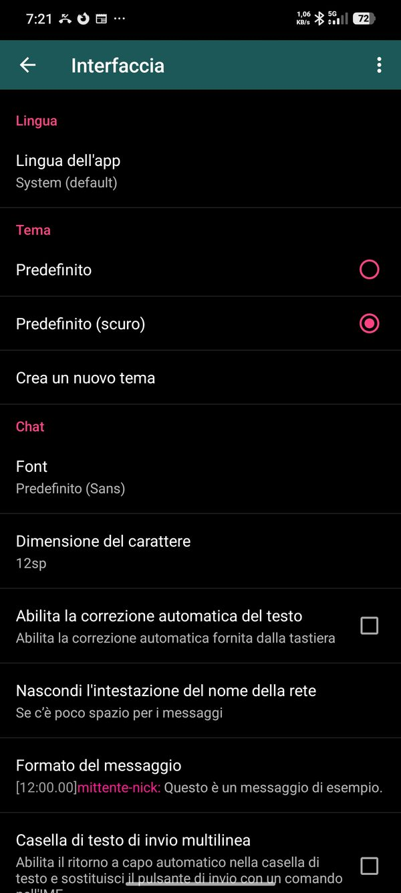
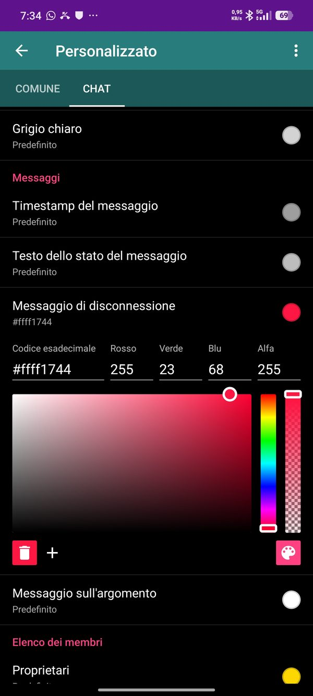
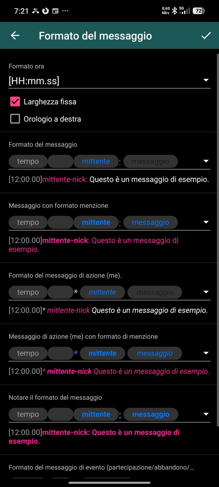

## Päivitykset ja varmuuskopiointi
Valinnainen päivitystarkistus käyttää virallisia GitHub Releaseja. TIARCA tukee myös Androidin salattua varmuuskopiointia/laitesiirtoa erillään TIARCAn manuaalisesta varmuuskopiosta.

## Yhteensopivuus ja vianmääritys
IRC-verkot käyttävät erilaisia palvelimia ja laajennuksia; palvelinpuolen ominaisuus toimii vain verkon tukiessa sitä. Yhteysongelmissa tarkista host, portti, TLS, nick ja SASL. Virheraportista poista salasanat, tokenit, henkilökohtaiset host/IP-tiedot ja muut arkaluonteiset tiedot.

## Tietosuoja, alkuperä ja lisenssi
IRC ei ole oletuksena päästä päähän salattu. TLS suojaa asiakas–palvelin-yhteyden, ei koko keskustelua E2EE:nä. TIARCA perustuu MrARM/MCMrARM:n Revolution IRC:hen ja jatkaa itsenäisenä GNU GPLv3 -projektina.
